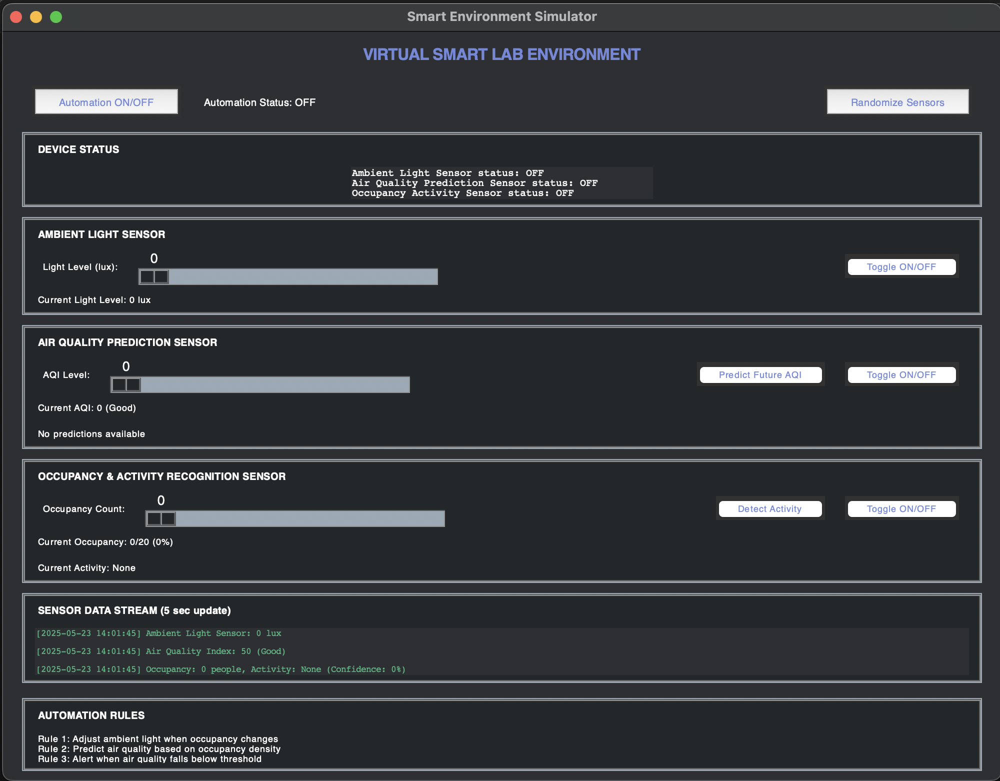

# Smart Home IoT Simulator

This project is a Python-based IoT simulator designed to emulate a smart home automation system. It provides a platform to simulate the behavior of various interconnected IoT devices commonly found in a smart home environment, managed by a central automation system. A comprehensive monitoring dashboard GUI allows for real-time visualization and control of the simulated smart home.

## Key Features

* **Device Emulation:** Simulates essential smart home devices including:
    * **Ambient Light Sensor:** Measures light levels in lux.
    * **Air Quality Prediction Sensor:** Monitors Air Quality Index (AQI) and can predict future levels.
    * **Occupancy & Activity Recognition Sensor:** Detects occupancy count and activity type within a space.
* **Central Automation System:** Manages device interactions and executes predefined automation rules (e.g., adjusting ambient light based on occupancy changes, predicting air quality based on occupancy density).
* **Interactive GUI Dashboard:** A Tkinter-based graphical user interface provides:
    * Real-time display of sensor data and device statuses.
    * Direct control over individual device parameters (e.g., light level, AQI, occupancy count).
    * Ability to toggle automation and individual sensors ON/OFF.
* **Randomized Environment:** Option to instantly randomize sensor readings to simulate dynamic real-world conditions.
* **Live Data Stream:** A dedicated section to view a continuous, updating log of raw sensor data.

## Dashboard Overview

The monitoring dashboard GUI is organized into several intuitive sections, as seen in the provided screenshot:

* **Automation Control (Top Left):** Features a button to toggle the central automation system ON/OFF and a label displaying its current status.
* **Randomize Sensors (Top Right):** A button to instantly generate new, random readings for all active sensors.
* **DEVICE STATUS:** A text box providing an immediate overview of the current ON/OFF status for the Ambient Light, Air Quality, and Occupancy sensors.
* **AMBIENT LIGHT SENSOR:**
    * **Light Level (lux):** A slider to manually adjust the ambient light level.
    * **Toggle ON/OFF:** A button to activate or deactivate the light sensor.
    * **Current Light Level:** Displays the real-time light intensity in lux.
* **AIR QUALITY PREDICTION SENSOR:**
    * **AQI Level:** A slider to manually set the Air Quality Index.
    * **Predict Future AQI:** A button to trigger a prediction of future AQI levels.
    * **Toggle ON/OFF:** A button to activate or deactivate the AQI sensor.
    * **Current AQI:** Shows the current AQI reading and its corresponding category (e.g., Good, Moderate).
    * **No predictions available:** Displays future AQI predictions when generated.
* **OCCUPANCY & ACTIVITY RECOGNITION SENSOR:**
    * **Occupancy Count:** A slider to manually set the number of occupants.
    * **Detect Activity:** A button to simulate activity detection within the space.
    * **Toggle ON/OFF:** A button to activate or deactivate the occupancy sensor.
    * **Current Occupancy:** Displays the current number of occupants and percentage of room capacity.
    * **Current Activity:** Shows the detected activity type.
* **SENSOR DATA STREAM (5 sec update):** A live text area that displays a chronological stream of raw sensor data updates every 5 seconds.
* **AUTOMATION RULES:** Lists the predefined rules that govern the smart home system's automated responses.

## Instructions

### How to Run the Simulation (Windows)

One of the ways to run the simulation after downloading the IoT simulator project:

1.  **Open the folder in the console:**
    * You can copy the path of the folder in Windows Explorer, then open your console (e.g., Command Prompt, PowerShell) and type `cd <path you copied>`.
2.  **Run the GUI:**
    * Type `python main.py` in the console. This command will execute the Python script and launch the simulator's graphical user interface, provided Python is installed on your computer and added to your system's PATH.

### How to Use the Dashboard

The GUI provides comprehensive controls and monitoring capabilities for the smart home system:

* **Overall Device Status:** Check the "DEVICE STATUS" text box, located under the "Automation ON/OFF" button, to quickly see if your Ambient Light, Air Quality, and Occupancy sensors are `ON` or `OFF`.
* **Toggle Automation:** Tap the "Automation ON/OFF" button at the top left to activate or deactivate the central automation logic that manages device interactions based on defined rules.
* **Randomize Sensor Data:** Click the "Randomize Sensors" button on the top right to instantly simulate dynamic conditions by generating new random readings for all active sensors.
* **Device-Specific Controls:**
    * For **Ambient Light Sensor**, **Air Quality Prediction Sensor**, and **Occupancy & Activity Recognition Sensor** sections:
        * Use the **sliders** to manually adjust the input values (e.g., light level, AQI, occupancy count).
        * Click the **"Toggle ON/OFF" buttons** within each section to change the active state of individual sensors.
        * Utilize specific action buttons like "Predict Future AQI" (for air quality) or "Detect Activity" (for occupancy) to trigger unique sensor functionalities.
* **Monitor Live Data:** Observe the "SENSOR DATA STREAM" at the bottom to view real-time updates of all collected sensor data, refreshing every 5 seconds.
* **Understand Automation Logic:** Refer to the "AUTOMATION RULES" section to understand the predefined logical conditions that the central automation system follows when active.